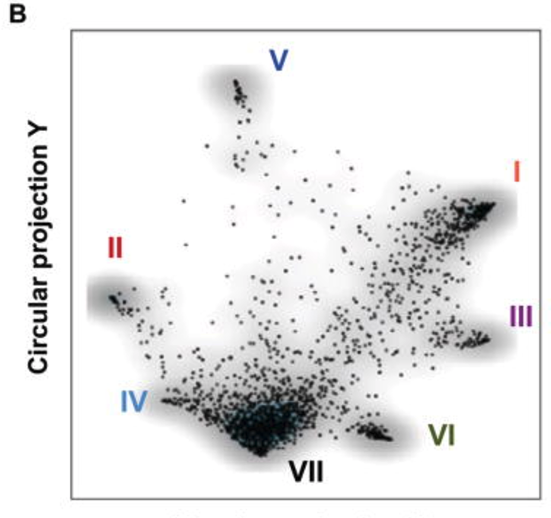
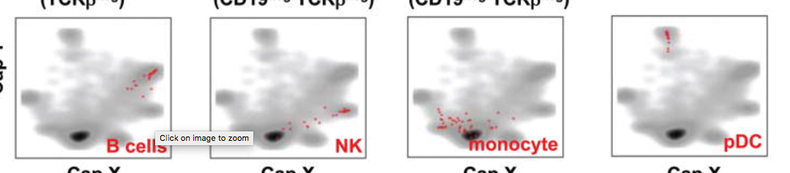

```{r read-chunk, include=FALSE, cache=FALSE}
knitr::read_chunk("chunks.R")
```

```{r knitr-opts-chunk, include=FALSE}
```

**Last updated:** `r Sys.Date()`

**Code version:** `r workflowr::extract_commit(".", 1)$sha1`

## try the code to find the 1041 cells

```{r,cache=TRUE,eval=TRUE,message=FALSE,warning=FALSE}
######  In this code, we try to replicate the CAP projection plot code sent

######  by Effi and others and also try to do the batchwise and cluster label 

######   wise distruct plots, and also do the PCA analysis

library(data.table)
Data=data.frame(fread("../data/singelcell/MouseJatinspleen/GSE54006_umitab.txt"));
gene_names=as.matrix(Data[,1]);
Exp_details=read.table(file="../data/singelcell/MouseJatinspleen/GSE54006_experimental_design.txt",fill=T);

#################   replicating the CAP  projection plot  ####################

indices=read.table("../data/singelcell/MouseJatinspleen/indices_1041_cells.txt");
indices=as.vector(as.matrix(indices));

ERCC_genes=grep("ERCC",gene_names);
Data_non_ERCC=Data[-ERCC_genes,];
counts =t(as.matrix(Data_non_ERCC[,-1]))
gene_list = gene_names
gene_list = gene_list[-ERCC_genes]
batch_well_ID=colnames(Data_non_ERCC)[-1]
bwlist=strsplit(batch_well_ID,"_");
index_ID = as.numeric(matrix(unlist(bwlist),nrow=2)[2,])  

filterlist=c("M34473","abParts","M13680","Tmsb4x","S100a4","B2m","Atpase6","Rpl23","Rps18","Rpl13","Rps19","H2-Ab1","Rplp1","Rpl4","Rps26","EF437368") ;
fcounts = counts[,-match(filterlist,gene_names[-ERCC_genes])];
gene_list = gene_list[-match(filterlist,gene_names[-ERCC_genes])]
dim(fcounts)

fcounts_reduced=fcounts[match(indices,index_ID),]
sample_list = match(indices,index_ID)
###  fcounts_reduced is the counts matrix of the 1041 cells for which the CAP plot was made and 
###  the 200091 genes of interest (removing controls)

```


```{r,cache=TRUE,eval=TRUE,message=FALSE,warning=FALSE}
devtools::install_github("jhsiao999/singleCellRNASeqMouseJaitinSpleen")

library(singleCellRNASeqMouseJaitinSpleen)

J_counts <- exprs(MouseJaitinSpleen)

cell_labels <- pData(MouseJaitinSpleen)

dim(J_counts)

grey_data = J_counts[gene_list,sample_list]
Bcell_list= grep("B cell",cell_labels$group_name)
NK_list = grep("NK_cell",cell_labels$group_name)
monocyte_list = grep("monocyte_or_neutrophil",cell_labels$group_name)
pD_list = grep("pDC",cell_labels$group_name)
pDminus_list = grep("CD8-pDC",cell_labels$group_name)
pDplus_list = pD_list[-which(pD_list %in% pDminus_list)]
CD8CD4_list = grep("ESAM",cell_labels$group_name)
CD86_list = grep("CD86",cell_labels$group_name)
splenocyte_list = grep("splenocyte",cell_labels$group_name)
labeled_list = c(Bcell_list,NK_list,monocyte_list,pDplus_list,pDminus_list,CD8CD4_list,CD86_list,splenocyte_list)
labeled_name = cell_labels$group_name[labeled_list]
# prepare the data
labeled_data = J_counts[gene_list,labeled_list]
dim(labeled_data)
# to get the label and unlabel data
total_list = c(sample_list,labeled_list)
total_data = J_counts[gene_list,total_list]
saveRDS(total_data,"../data/singelcell/MouseJatinspleen/labelunlabel/totaldata.rds")
saveRDS(grey_data,"../data/singelcell/MouseJatinspleen/labelunlabel/greydata.rds")
saveRDS(labeled_data,"../data/singelcell/MouseJatinspleen/labelunlabel/labeldata.rds")
```


```{r,warning=FALSE,cache=TRUE,eval=TRUE,message=FALSE}
grey_data = readRDS("../data/singelcell/MouseJatinspleen/labelunlabel/greydata.rds")
col_sum = colSums(grey_data)
row_sum = rowSums(grey_data)
gcol_index = which(col_sum != 0)
grow_index = which(row_sum != 0)

Binary_count = 1 * (grey_data[grow_index,gcol_index] != 0)
Boolean_count = 2*( Binary_count - 1/2)
#source('~/HG/LogisticFlash/Rcode/GD_Rfuncrtions.R')
#g_cloud = GL_flash(Boolean_count,K = 6)
#saveRDS(g_cloud,file = "../data/singelcell/MouseJatinspleen/labelunlabel/g_cloud.rds")
g_cloud = readRDS("../data/singelcell/MouseJatinspleen/labelunlabel/g_cloud.rds")
```


```{r,warning=FALSE,cache=TRUE,eval=TRUE,message=FALSE}
total_data = readRDS("../data/singelcell/MouseJatinspleen/labelunlabel/totaldata.rds")
col_sum = colSums(total_data)
row_sum = rowSums(total_data)
tcol_index = which(col_sum != 0)
trow_index = which(row_sum != 0)
Binary_count = 1 * (total_data[trow_index,tcol_index] != 0)
Boolean_count = 2*( Binary_count - 1/2)
#source('~/HG/LogisticFlash/Rcode/GD_Rfuncrtions.R')
#g_total = GL_flash(Boolean_count,K = 6)
#saveRDS(g_total,file = "../data/singelcell/MouseJatinspleen/labelunlabel/g_total.rds")
g_total = readRDS("../data/singelcell/MouseJatinspleen/labelunlabel/g_total.rds")
```

for the cloud

```{r}
par(mfrow = c(2,2), mar = c(5,4,4,2) - 1.9)
for(i in 1:6){

plot(as.numeric(as.factor(cell_labels$sequencing_batch[sample_list])),g_cloud$f[,i],main = "sequencing_batch")
plot(as.numeric(as.factor(cell_labels$amplification_batch[sample_list])),g_cloud$f[,i],main = "amplification_batch")
#plot(as.numeric(as.factor(cell_labels$group_name[sample_list])),g_cloud$f[,i],main = "group_name")
}
for(i in 1:6){
  barplot(g_cloud$f[,i],main = paste("factor",i))
}
```


```{r}
plot(g_cloud$f[,4],g_cloud$f[,5])
```

need to project the labeled data on the cloud

```{r}
projectf = t(labeled_data[grow_index,]) %*% g_cloud$l
for(i in 1:6)plot(projectf[,i])
plot(projectf[,3],projectf[,4])
new_group_name = cell_labels$group_name[labeled_list]
cell_type = unique(new_group_name)
points(projectf[which(new_group_name == "B cell"),3],projectf[which(new_group_name == "B cell"),4],col = "red")
points(projectf[which(new_group_name == "GC B cell"),3],
       projectf[which(new_group_name == "GC B cell"),4],col = "red")
points(projectf[which(new_group_name == "CD8+CD86+"),3],
       projectf[which(new_group_name == "CD8+CD86+"),4],col = "yellow")
points(projectf[which(new_group_name == "CD8+CD86-"),3],
       projectf[which(new_group_name == "CD8+CD86-"),4],col = "yellow")
points(projectf[which(new_group_name == "NK_cell"),3],
       projectf[which(new_group_name == "NK_cell"),4],col = "purple")
points(projectf[which(new_group_name == "CD8-pDC"),3],
       projectf[which(new_group_name == "CD8-pDC"),4],col = "forestgreen")
points(projectf[which(new_group_name == "CD8+pDC"),3],
       projectf[which(new_group_name == "CD8+pDC"),4],col = "green")
points(projectf[which(new_group_name == "CD8-CD4+ESAM+"),3],
       projectf[which(new_group_name == "CD8-CD4+ESAM+"),4],col = "yellow")
points(projectf[which(new_group_name == "splenocyte"),3],
       projectf[which(new_group_name == "splenocyte"),4],col = "skyblue")
points(projectf[which(new_group_name == "monocyte_or_neutrophil"),3],
       projectf[which(new_group_name == "monocyte_or_neutrophil"),4],col = "blue")
```

```{r}
projectf = t(labeled_data[grow_index,]) %*% g_cloud$l
for(i in 1:6)plot(projectf[,i])
plot(projectf[,4],projectf[,5])
new_group_name = cell_labels$group_name[labeled_list]
cell_type = unique(new_group_name)
points(projectf[which(new_group_name == "B cell"),4],projectf[which(new_group_name == "B cell"),5],col = "red")
points(projectf[which(new_group_name == "GC B cell"),4],
       projectf[which(new_group_name == "GC B cell"),5],col = "red")
points(projectf[which(new_group_name == "CD8+CD86+"),4],
       projectf[which(new_group_name == "CD8+CD86+"),5],col = "yellow")
points(projectf[which(new_group_name == "CD8+CD86-"),4],
       projectf[which(new_group_name == "CD8+CD86-"),5],col = "yellow")
points(projectf[which(new_group_name == "NK_cell"),4],
       projectf[which(new_group_name == "NK_cell"),5],col = "purple")
points(projectf[which(new_group_name == "CD8-pDC"),4],
       projectf[which(new_group_name == "CD8-pDC"),5],col = "forestgreen")
points(projectf[which(new_group_name == "CD8+pDC"),4],
       projectf[which(new_group_name == "CD8+pDC"),5],col = "green")
points(projectf[which(new_group_name == "CD8-CD4+ESAM+"),4],
       projectf[which(new_group_name == "CD8-CD4+ESAM+"),5],col = "yellow")
points(projectf[which(new_group_name == "splenocyte"),4],
       projectf[which(new_group_name == "splenocyte"),5],col = "skyblue")
points(projectf[which(new_group_name == "monocyte_or_neutrophil"),4],
       projectf[which(new_group_name == "monocyte_or_neutrophil"),5],col = "blue")

```


```{r}
par(mfrow = c(2,3), mar = c(5,4,4,2) - 1.9)
for(i in 1:6){

plot(as.numeric(as.factor(cell_labels$sequencing_batch[total_list[tcol_index]])),g_total$f[,i],main = "sequencing_batch")
plot(as.numeric(as.factor(cell_labels$amplification_batch[total_list[tcol_index]])),g_total$f[,i],main = "amplification_batch")
plot(as.numeric(as.factor(cell_labels$group_name[total_list[tcol_index]])),g_total$f[,i],main = "group_name")
}
par(mfrow = c(2,2), mar = c(5,4,4,2) - 1.9)
for(i in 1:6){
  barplot(g_total$f[,i],main = paste("factor",i))
}
```


```{r}
par(mfrow = c(1,2), mar = c(5,4,4,2) - 1.9)
new_group_name = cell_labels$group_name[total_list[tcol_index]]
cell_type = unique(new_group_name)
plot(g_total$f[which(new_group_name == "CD11c+"),3],g_total$f[which(new_group_name == "CD11c+"),4],col = grey(0.8))
plot(g_total$f[,3],g_total$f[,4],col = grey(0.8))
points(g_total$f[which(new_group_name == "B cell"),3],g_total$f[which(new_group_name == "B cell"),4],col = "red")
points(g_total$f[which(new_group_name == "GC B cell"),3],
       g_total$f[which(new_group_name == "GC B cell"),4],col = "red")
points(g_total$f[which(new_group_name == "CD8+CD86+"),3],
       g_total$f[which(new_group_name == "CD8+CD86+"),4],col = "yellow")
points(g_total$f[which(new_group_name == "CD8+CD86-"),3],
       g_total$f[which(new_group_name == "CD8+CD86-"),4],col = "yellow")
points(g_total$f[which(new_group_name == "CD8-pDC"),3],
       g_total$f[which(new_group_name == "CD8-pDC"),4],col = "forestgreen")
points(g_total$f[which(new_group_name == "CD8+pDC"),3],
       g_total$f[which(new_group_name == "CD8+pDC"),4],col = "green")
points(g_total$f[which(new_group_name == "CD8-CD4+ESAM+"),3],
       g_total$f[which(new_group_name == "CD8-CD4+ESAM+"),4],col = "yellow")
points(g_total$f[which(new_group_name == "splenocyte"),3],
       g_total$f[which(new_group_name == "splenocyte"),4],col = "skyblue")
points(g_total$f[which(new_group_name == "monocyte_or_neutrophil"),3],
       g_total$f[which(new_group_name == "monocyte_or_neutrophil"),4],col = "blue")
points(g_total$f[which(new_group_name == "NK_cell"),3],
       g_total$f[which(new_group_name == "NK_cell"),4],col = "purple")
```


```{r}
plot_cell_grey = function(i,j){
par(mfrow = c(1,2), mar = c(5,4,4,2) - 1.9,pty="s")
new_group_name = cell_labels$group_name[total_list[tcol_index]]
cell_type = unique(new_group_name)
plot(g_total$f[which(new_group_name == "CD11c+"),i],g_total$f[which(new_group_name == "CD11c+"),j],col = grey(0.8),main = "grey cloud",asp=1)
plot(g_total$f[,i],g_total$f[,j],col = grey(0.8), main = "all labeled cells on the cloud",asp=1)
points(g_total$f[which(new_group_name == "B cell"),i],g_total$f[which(new_group_name == "B cell"),j],col = "red")
points(g_total$f[which(new_group_name == "GC B cell"),i],
       g_total$f[which(new_group_name == "GC B cell"),j],col = "red")
points(g_total$f[which(new_group_name == "CD8+CD86+"),i],
       g_total$f[which(new_group_name == "CD8+CD86+"),j],col = "yellow")
points(g_total$f[which(new_group_name == "CD8+CD86-"),i],
       g_total$f[which(new_group_name == "CD8+CD86-"),j],col = "yellow")
points(g_total$f[which(new_group_name == "CD8-pDC"),i],
       g_total$f[which(new_group_name == "CD8-pDC"),j],col = "forestgreen")
points(g_total$f[which(new_group_name == "CD8+pDC"),i],
       g_total$f[which(new_group_name == "CD8+pDC"),j],col = "green")
points(g_total$f[which(new_group_name == "CD8-CD4+ESAM+"),i],
       g_total$f[which(new_group_name == "CD8-CD4+ESAM+"),j],col = "yellow")
points(g_total$f[which(new_group_name == "splenocyte"),i],
       g_total$f[which(new_group_name == "splenocyte"),j],col = "skyblue")
points(g_total$f[which(new_group_name == "monocyte_or_neutrophil"),i],
       g_total$f[which(new_group_name == "monocyte_or_neutrophil"),j],col = "blue")
points(g_total$f[which(new_group_name == "NK_cell"),i],
       g_total$f[which(new_group_name == "NK_cell"),j],col = "purple")
}
plot_cell_grey(4,3)
```

```{r,echo=FALSE}
par(mfrow = c(1,4), mar = c(5,4,4,2) - 1.9,pty="s")
new_group_name = cell_labels$group_name[total_list[tcol_index]]
cell_type = unique(new_group_name)
plot(g_total$f[which(new_group_name == "CD11c+"),4],g_total$f[which(new_group_name == "CD11c+"),3],col = grey(0.8),xlim = c(-40,40),ylim = c(-30,60),main = "B cell")
# plot(g_total$f[,i],g_total$f[,j],col = grey(0.8))
points(g_total$f[which(new_group_name == "B cell"),4],g_total$f[which(new_group_name == "B cell"),3],col = "red")
points(g_total$f[which(new_group_name == "GC B cell"),4],
       g_total$f[which(new_group_name == "GC B cell"),3],col = "red")
plot(g_total$f[which(new_group_name == "CD11c+"),4],g_total$f[which(new_group_name == "CD11c+"),3],col = grey(0.8),xlim = c(-40,40),ylim = c(-30,60),main = "NK cell")
points(g_total$f[which(new_group_name == "NK_cell"),4],
       g_total$f[which(new_group_name == "NK_cell"),3],col = "purple")
plot(g_total$f[which(new_group_name == "CD11c+"),4],g_total$f[which(new_group_name == "CD11c+"),3],col = grey(0.8),xlim = c(-40,40),ylim = c(-30,60),main = "monocyte")
points(g_total$f[which(new_group_name == "monocyte_or_neutrophil"),4],
       g_total$f[which(new_group_name == "monocyte_or_neutrophil"),3],col = "blue")
plot(g_total$f[which(new_group_name == "CD11c+"),4],g_total$f[which(new_group_name == "CD11c+"),3],col = grey(0.8),xlim = c(-40,40),ylim = c(-30,60),main = "pD cell")
points(g_total$f[which(new_group_name == "CD8-pDC"),4],
       g_total$f[which(new_group_name == "CD8-pDC"),3],col = "forestgreen")
points(g_total$f[which(new_group_name == "CD8+pDC"),4],
       g_total$f[which(new_group_name == "CD8+pDC"),3],col = "green")
```





## Session Information

```{r session-info}
```
